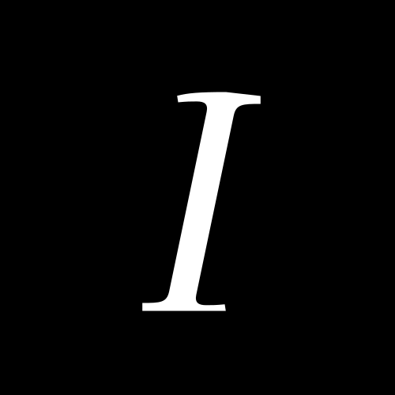

  

<h1 align="center">iota</h1>

  A ray tracer that renders inside the terminal.

  MIT · C11 · no dependencies · macOS and Linux

## Overview

iota casts rays in a terminal, one per cell, and keeps only what a ray hit
and what to do next: shade it, bounce it off a mirror, or let it go into the
fog. The terminal, the cell grid, the ray caster, the frame loop and the
fixed step are the engine's; the scene is the client's.

This repository carries the first scene: a mirror on a wall. More scenes —
portals, stairs, shadows, water — follow the same shape.

## Build

    make            build iota
    make install    install into $(PREFIX)/bin, /usr/local by default
    make clean      remove the build

The build is warning-clean under `-Wall -Wextra -Wpedantic -Wshadow
-Wstrict-prototypes -Wconversion`; CI builds it with every warning fatal.

## Run

    make run

A frame renders within a time budget; when a frame comes back early the
engine raises the supersampling to two rays per cell, and when it runs out
of budget it drops back to one. The window is any size the terminal gives
it, and the status line shows the millisecond cost, the ray count, the
recursion depth and whether the budget was hit.

## Controls

| Key | Action |
| --- | --- |
| `W` `A` `S` `D` | move |
| arrow keys | look |
| `Esc` | quit |

## The renderer

One ray per cell at the base sample, nearest hit kept, so thin geometry
survives and objects occlude the floor and each other. A surface is shaded
by the scene's lights — ambient plus every point and sun light that sees
it — and fog takes over with distance.

A hit carries an action. A plain surface is shaded and done; a mirror
reflects the ray about the surface normal and traces again, up to two
bounces deep, each bounce measured against the frame's time budget. When
the budget runs out the frame stops at the fog, the status line says
`BUDGET`, and the engine lowers the sample count for the next frame.

## Layout

    include/    the engine's headers
    src/        the engine
    demos/      the scenes
    assets/     the mark

## License

MIT. See [LICENSE](LICENSE).
